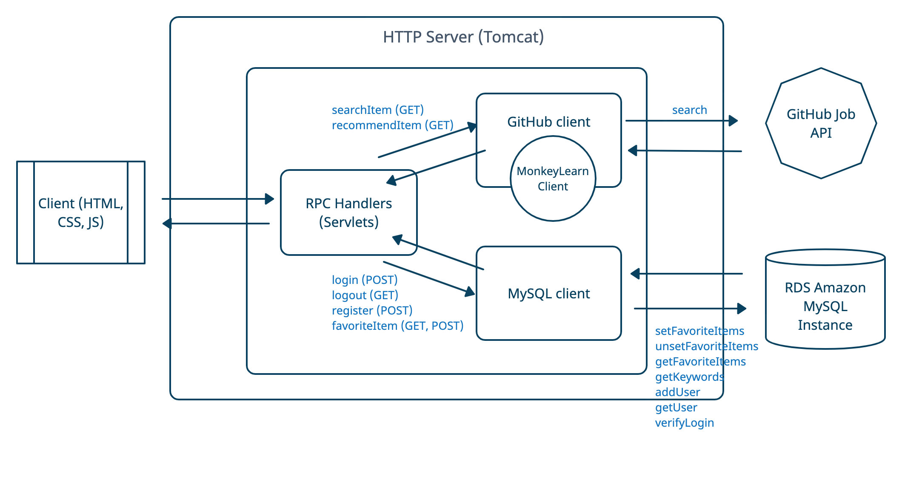

# TL;DR
This is a job search and recommmendation engine written in Java, implementing keyword extraction and content-based recommendation. It implements RESTful APIs using Java servlets, retrieves job descriptions using Github API and stores data in MySQL. Users can: 
- Sign up and log in to the service 
- Search nearby available job positions
- Save favorite job positions to account
- Get recommendated positions based on extracted keywords from favorites

                                              

## Behind the Scenes 
Java servlets are Java classes to handle RPC on the server side. Six Java servlets are created in this app: ```searchItem```,```recommendItem```,```login```,```logout```,```register```,```favoriteItem```.


```searchItem```communicates with the GitHub Jobs API client to get available job positions.
```login```,```logout```,```register```, and```favoriteItem```communicates with the database to save users and postings. 
```recommendItem```does both to relay keywords from database to the search. 

Keyword extraction uses TF-IDF algorithm implemented by MonkeyLearn API. **TF (Term frequency)** is the frequency of a word in a document. **IDF (Inverse Document Frequency)** is the importance of a word in all text. Final score = TF * IDF gives a measure to the importance of a particular word in this context. 

A recommendation system seeks to predict the "rating" a user would give to an item. **Content-based recommendation** makes such prediction based on similarity shared between items themselves. This is usually used when we don't have enough user activity to begin with. In contrast, **user-based recommendation** makes the prediction based on similarity between users, while **item-based recommendation** will consider both similarity between items as well as the user's history of liking similar items. 

Session is used to store a series of interations of the user currently visiting the webapp. When a user logs in, a session ID is assigned to the user. Users need to provide session ID to access resources that require authentication. ```HttpSession``` is an interface provided by the servlet API. HttpSession allows us to set attributes in key-value pairs that can be retrieved in future requests. The session ends when the user logs out or inactive after a predetermined period of time.

### Dependencies
- MonkeyLearn API: https://monkeylearn.com/api/v3/#java
- GitHub Jobs API: https://jobs.github.com/api
- Apache Tomcat: http://tomcat.apache.org/
- MySQL Java connector: https://mvnrepository.com/artifact/mysql/mysql-connector-java
